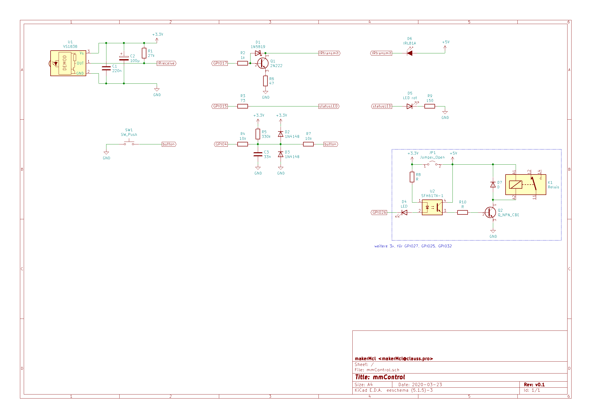

# mmControl

An IoT-device for controlling multimedia devices via Web-UI or Alexa.

## Functionality
* switch on TV and soundbar via IR commands
* select channel of TV
* switch off unused secondary devices (also usable to reset the firestick)
	* delay switch off (e.g. to revoke issued commands)

* user controlled via 
	* alexa (fauxmo integration)
	* responsive web interface
	* ir possible (not yet implemented)

* simple web interface with
	* updated status
	* optional receiving IR commands, for new devices

## Hardware
* based on ESP32
* interface circuitry ([printable version](docs/mmControl.pdf)): 

## Build preparations
* check out project from github.com
* update submodule for IRremote (required due to ESP32-patch for IRsend)
	`git submodule update`
* copy and customize local instance of 	`platformio_local.ini`

## Licensing & Contact
Licensed under LGPL v3.

Email: makerMcl (at) clauss.pro
Please only email me if it is more appropriate than creating an Issue / PR. I will not respond to requests for adding support for particular boards, unless of course you are the creator of the board and would like to cooperate on the project. I will also ignore any emails asking me to tell you how to implement your ideas. However, if you have a private inquiry that you would only apply to you and you would prefer it to be via email, by all means.

## Copyright

Copyright 2020 Matthias Claufl

## TODOs
* fix IR receive logic (is there a timing issue on ESP32?)
* implement unit tests
* parameterizing device configuration (config via WebUI, save in flash?)
* control secondary devices via bluetooth remote control

later:
* allow user interface via IR remote control (be aware to use IR codes not in use otherwise to avoid control interference)
