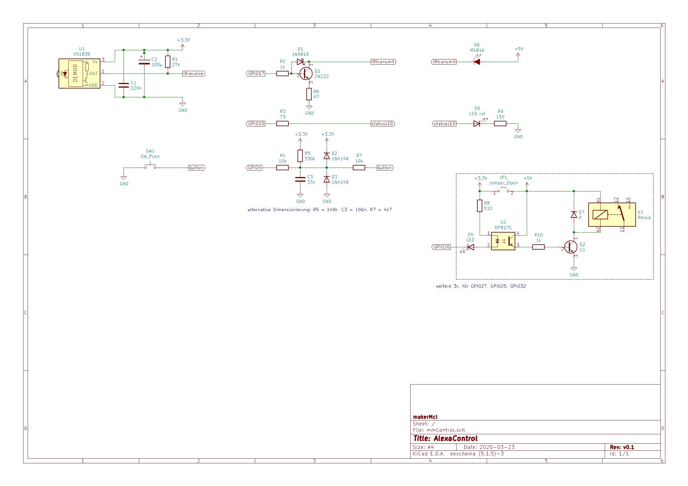

# mmControl

An IoT-device for controlling multimedia devices via Web-UI or Alexa.

## Functionality
* switch on TV and soundbar via IR commands
* select channel of TV
* switch off unused secondary devices (also usable to reset the firestick)
	* delay switch off (e.g. to revoke issued commands)

* user controlled via 
	* alexa (fauxmo integration)
	* responsive web interface
	* ir possible (not yet implemented)

* simple web interface with
	* updated status
	* optional receiving IR commands, for new devices

## Hardware
* based on ESP32
* interface circuitry ([printable version](docs/mmControl.pdf)): 

### Hints on implementation
* use star layout (connect 5V input power only at one point)
* I used a simple stripe-pcb from Radioshack for hosting the ESP32-board
* TODO: check if a larger capacitor is possible (while keeping RC-behaviour)

### Design considerations
* output lines have resistor for short-circuit-proof
* button input gets additional protection
* drive relais shields from original 5V: 4times 80mA is a considerable amount
* provide the GND connectionof relais shield from the main power source point, to reach a star layout. 

  Do not connect the GND ping of the relais shield to GND of your microcontroller board or PCB but instead 
  to your main power connector. This should minimize effects from the coils to the microcontroller.
* IR-led driving circuitry used schottky-bypass for faster reactions, see [docs/ir_output_@*.jpg](docs/) to check effects
* Button must be on RTC-GPIO, candidates are: GPIO 2, 4, 13, 14, 15, 25, 26, 27, 32, 33, 34, 35, 36, 39
* input only pins (no internal pull-up!) are GPIO34..39; do no use Pins with limited variance, these are: GPIO0, 1, 3, 6..12

## Build Dependencies
* add as git-submodule into `lib/`
    * `universalUI`, from https://github.com/makerMcl/universalUi.git
    * `blinkLed`, from https://github.com/makerMcl/blinkled.git
    * `Streaming`, from https://github.com/janelia-arduino/Streaming.git
        * Note: I use Streaming v6 for `_WIDTH`-feature: in platformio lib registry is still version 5
* copy `universalUIsettings.h_sample` into `universalUIsettings.h` and provide WLAN and OTA settings
* copy and customize local instance of `platformio_local.ini`, use `platformio_local.ini_sample` as template

## Build preparations
* check out project
* update submodule for IRremote (required due to ESP32-patch for IRsend)
	`git submodule update`

## Licensing & Contact
Licensed under GPL v3.

Email: makerMcl (at) clauss.pro

Please only email me if it is more appropriate than creating an Issue / PR. I will not respond to requests for adding support for particular boards, unless of course you are the creator of the board and would like to cooperate on the project. I will also ignore any emails asking me to tell you how to implement your ideas. However, if you have a private inquiry that you would only apply to you and you would prefer it to be via email, by all means.

## Copyright

Copyright 2020 Matthias Claufl

## Helpful resources
Some resources for a deeper understanding:

* http://paulmurraycbr.github.io/ArduinoTheOOWay.html - implementing libs, useful patterns
* http://www.ganssle.com/debouncing.pdf	- analytic of bounce of buttons
* http://www.elektronik-kompendium.de/public/schaerer/pullr.htm - input protection circuit
* https://electronicbase.net/de/tiefpass-berechnen/#rc-tiefpass-rechner - helps calculating alternative RC-combinations (and take care to respect the voltage divider R1:R2)
* https://www.elektronik-kompendium.de/sites/slt/0208031.htm - fast switching resistor

I am grateful for so many authors that helped learning CPP till I felt myself ok with my code. That is one reason I do publish this result of my hobby.

Note: To avoid unmonitored commercial use of this work while giving back to the community, I choose the GPL licence.

## TODOs
* fix IR receive logic (is there a timing issue on ESP32?)
* implement unit tests
* parameterizing device configuration (config via WebUI, save in flash?)
* control secondary devices via bluetooth remote control
* basic authentication for web-ui access

later:
* allow user interface via IR remote control (be aware to use IR codes not in use otherwise to avoid control interference)
